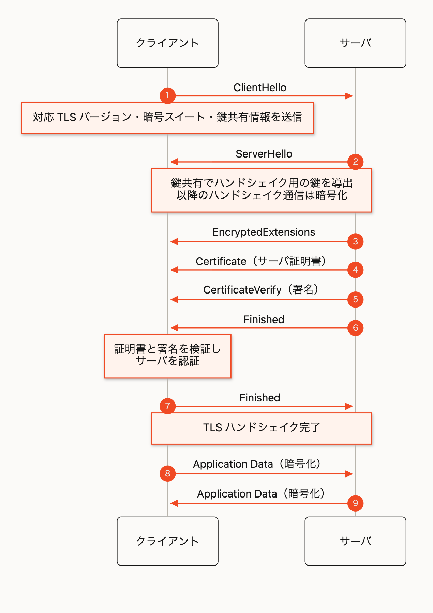

# TLS 1.3 ハンドシェイクの流れ

TLS 1.3 では、`ClientHello` と `ServerHello` で鍵共有を行い、サーバ証明書を含む以降のハンドシェイクを盗聴・改ざんから保護するための対称鍵を導出します。つまり、`ServerHello` の直後から通信は暗号化されます。

ただしこの時点では、クライアントは接続相手が正規のサーバかをまだ確認できていません。後から届くサーバ証明書と `CertificateVerify` の署名を検証して、初めて正規のサーバだと判断します。

## 1. ClientHello

クライアントは接続を開始するため、次の情報をサーバへ送ります。

- 対応する TLS バージョン
- 利用可能な暗号スイート
- 鍵共有に使う一時公開鍵（`key_share`）
- `client_random` などの接続ごとに異なる値

`client_random` はクライアントが接続ごとに生成するランダムな値です。`ServerHello` にも同様の `server_random` が含まれます。これらの値はハンドシェイク内容の一部として署名や `Finished` の検証対象になり、接続ごとの通信を結び付けます。

TLS 1.3 でハンドシェイク用鍵を導出する中心となるのは `key_share` による鍵共有です。`client_random` 自体を通信の暗号鍵として使うわけではありません。

## 2. ServerHello とハンドシェイク用鍵の導出

サーバは使用する TLS バージョン・暗号スイート・鍵共有用の一時公開鍵を選び、`server_random` とともに `ServerHello` で返します。

両者はそれぞれの一時鍵から共有秘密を計算し、そこからハンドシェイク用の送受信鍵を導出します。この時点で、後続のハンドシェイクメッセージは暗号化できますが、クライアントはまだサーバを認証していません。

## 3. この接続で使う鍵

TLS 1.3 では、鍵共有で得た値から用途ごとに異なる鍵を導出します。

| 種別                             | 役割                                                                   |
| -------------------------------- | ---------------------------------------------------------------------- |
| 一時鍵ペア（`key_share`）        | 鍵共有に使う。通信の暗号化には直接使わない。                           |
| 共有秘密                         | クライアントとサーバが鍵共有で計算する、鍵を導出するための共通の材料。 |
| ハンドシェイク用送受信鍵         | `Certificate`、`CertificateVerify`、`Finished` などを暗号化する。      |
| アプリケーションデータ用送受信鍵 | ハンドシェイク完了後の HTTP などを暗号化する。                         |

送信方向ごとに別の対称鍵が使われます。また、証明書に対応する公開鍵・秘密鍵はサーバを認証するための鍵であり、通信を暗号化する上記の鍵とは別物です。

## 4. 暗号化されたサーバ認証

`ServerHello` の後、サーバは暗号化されたハンドシェイクメッセージを順に送ります。

- `EncryptedExtensions`: `ClientHello` で要求された拡張機能に対するサーバの応答を、暗号化して通知する。たとえば使用するアプリケーションプロトコル（ALPN）などを含む
- `Certificate`: サーバ証明書チェーンを送信
- `CertificateVerify`: それまでのハンドシェイク内容に対する署名を送信し、証明書の秘密鍵を保持していることを証明
- `Finished`: ここまでのハンドシェイク内容が改ざんされていないことを確認するメッセージ

クライアントは証明書チェーンの信頼性・有効期限・接続先名を確認し、さらに証明書内の公開鍵で `CertificateVerify` の署名を検証します。ここで初めて、接続相手が正しいサーバであることを確認できます。

## 5. Client Finished とアプリケーションデータ

検証に成功したクライアントは `Finished` を返します。これにより双方がハンドシェイク内容を確認し、TLS ハンドシェイクが完了します。

以降は、ハンドシェイクから導出したアプリケーションデータ用の鍵で、HTTP などの通信を暗号化します。

> クライアント証明書による認証（mTLS）を使う場合は、サーバの `CertificateRequest` に続けて、クライアントも `Certificate`、`CertificateVerify`、`Finished` を送ります。
